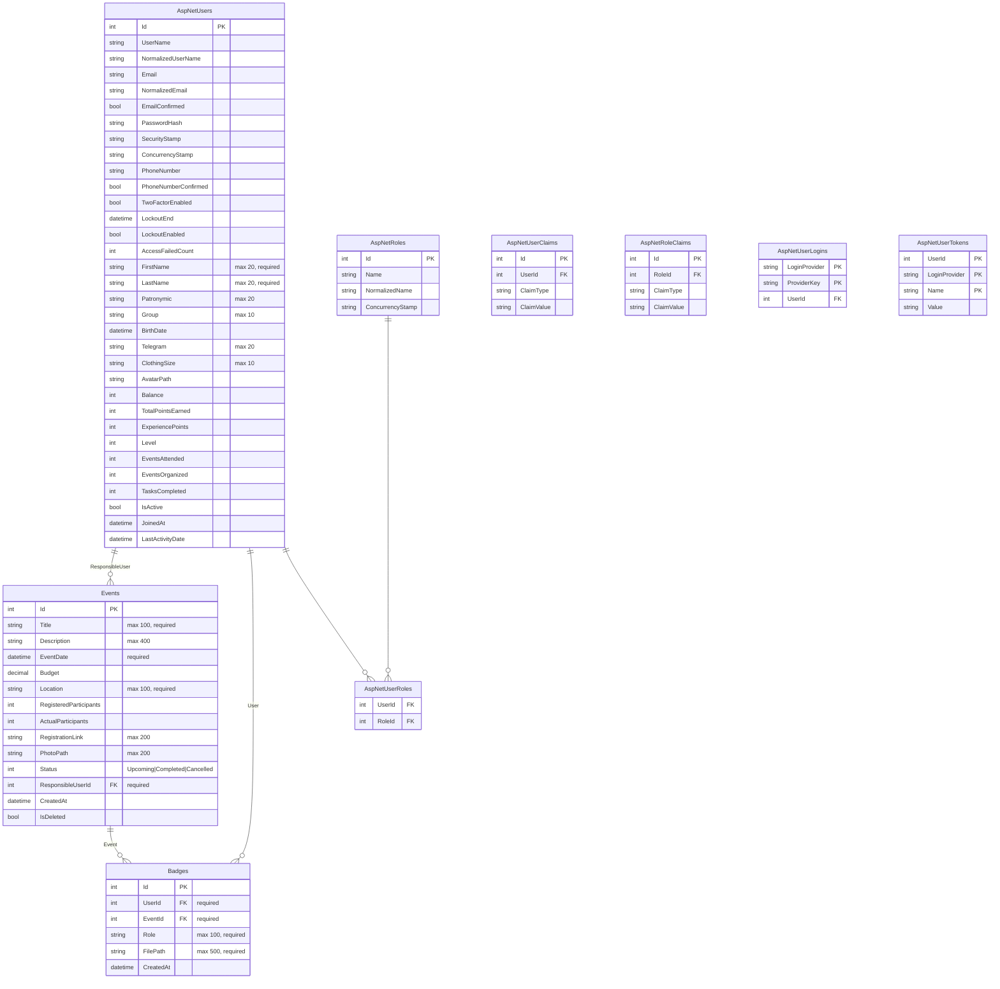
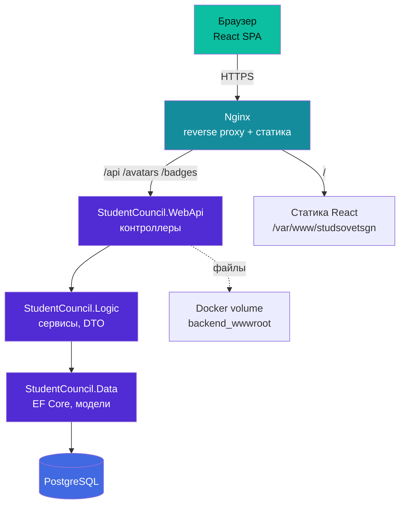
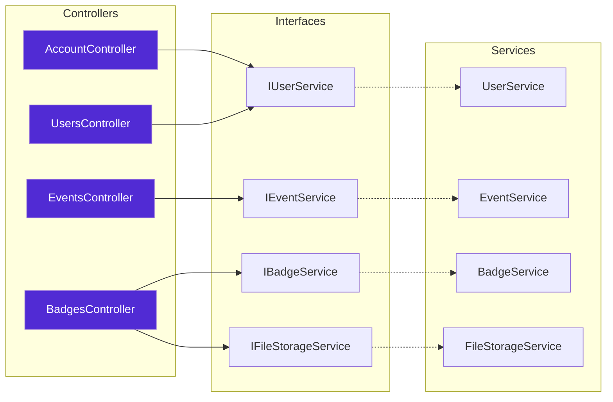

<p align="center">
  
</p>

<h1 align="center">Платформа студенческого совета СГН</h1>

<p align="center">
  Веб-приложение для управления студенческим советом: участники, мероприятия, бейджи, аналитика.
</p>

<p align="center">
  <a href="https://studsovetsgn.ru"></a>
  
  
  
  
</p>

---

## О проекте

Внутренняя платформа для студенческого совета СГН МГТУ им. Н.Э. Баумана. Заменяет ручной учёт в таблицах и мессенджерах единой системой с ролевой моделью, геймификацией и аналитикой.

**Что умеет:**

- Учёт участников с ролями (Admin / Leader / Member)
- Организация мероприятий: регистрация, явка, бюджет
- Выдача бейджей с PDF-подтверждением
- Аналитика: статистика, топы, динамика по месяцам
- Двухфакторная аутентификация (TOTP)

---

## Структура

```text
StudentCouncil/
├── StudentCouncil.Data/      # DbContext, модели, миграции
├── StudentCouncil.Logic/     # DTO, интерфейсы, сервисы
├── StudentCouncil.WebApi/    # Контроллеры, Program.cs, wwwroot
├── StudentCouncil.Frontend/  # React SPA (Vite)
├── docker-compose.yml
├── Dockerfile
└── openapi.yaml
```

##  Документация API

- [Swagger UI](https://digital-sgn.github.io/StudentCouncilPlatform-API)
- [openapi.yaml](openapi.yaml) — спецификация в репозитории
- Swagger в dev-режиме: `http://localhost:8080/swagger`

## Стек

**Backend**  


**Frontend**  


**Инфраструктура**  


---

## Архитектура

### Схема БД



### Архитектура слоёв




### Компоненты бэкенда 


---

## Локальный запуск

---

## Docker

---


## Ссылки

- Сайт: [studsovetsgn.ru](https://studsovetsgn.ru)
- Справочник отдела: [Handbook](https://github.com/Digital-SGN/Handbook)
- Организация на GitHub: [Digital-SGN](https://github.com/Digital-SGN)

---

<p align="center">
  <sub>Отдел цифрового развития ССФ СГН · 2026</sub>
</p>
